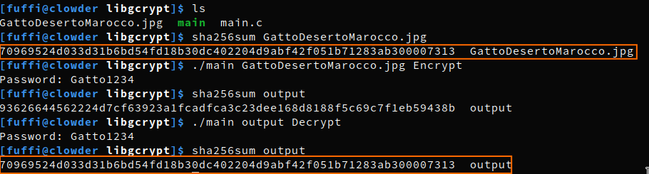
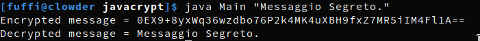
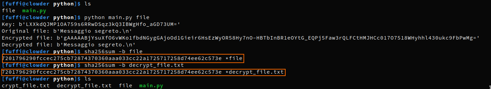

# FILE SYSTEM SICURI

## RESPONSABILITÁ

| Funzione                                    	| Nome                                 	| Data            	|
|----------------------------------------------	|--------------------------------------	|-----------------	|
| Redatto, controllato, approvato ed emesso da 	| Mandrile Flavio<br>Meineri Valentina 	| 02 novembre 2022 	|
  
## STORIA DELLE VARIAZIONI

| **Versione**    	| **Data emissione** 	| **Parte modificata** 	|
|-----------------	|--------------------	|----------------------	|
| Bozza           	| 14 ottobre  2022   	| Documento completo   	|
| Versione Finale 	| 02 novembre 2022    	| Documento completo   	|

## SOMMARIO

- [INTRODUZIONE](#introduzione)
  * [COME RENDERE UN FILESYSTEM SICURO](#come-rendere-un-filesystem-sicuro)
- [RIFERIMENTI](#riferimenti)
- [DEFINIZIONI E ACRONIMI](#definizioni-e-acronimi)
- [ELENCO E DESCRIZIONE DELLE LIBRERIE INDIVIDUATE](#elenco-e-descrizione-delle-librerie-individuate)
  * [LIBGCRYPT](#libgcrypt)
    + [DESCRIZIONE](#descrizione)
    + [API](#api)
    + [ESEMPI PRATICI](#esempi-pratici)
    + [ESECUZIONE](#esecuzione)
  * [JAVAX.CRYPTO](#javaxcrypto)
    + [DESCRIZIONE](#descrizione-1)
    + [API ](#api-1)
    + [ESEMPI PRATICI](#esempi-pratici-1)
    + [ESECUZIONE](#esecuzione-1)
  * [CRYPTOGRAPHY](#cryptography)
    + [API ](#api-2)
    + [ESEMPI PRATICI](#esempi-pratici-2)
    + [ESECUZIONE](#esecuzione-2)
- [OGGETTI DELLA RICERCA PIù INTERESSANTI E UTILI](#oggetti-della-ricerca-piu-interessanti-e-utili)
  * [AES](#aes)
    + [Come funziona l'algoritmo?](#come-funziona-lalgoritmo)
- [CONCLUSIONI](#conclusioni)
  * [OBIETTIVI FUTURI](#obiettivi-futuri)

## INTRODUZIONE
### COME RENDERE UN FILESYSTEM SICURO
Rendere un filesystem sicuro significa impedire la perdita e/o la distribuzione di dati importanti.

Diversi filesystem attualmente hanno trovato una soluzione per evitare la corruzione dei dati attraverso il [Journaling](#journaling). Questi filesystem registrano le azioni ancora da compiere in una struttura dati in modo da poter riprendere l'ultima azione se interrotta da un crash o blackout.

Questo sistema però non è sufficiente, il motivo principale per cui i dati vengono persi è colpa dell'utente che non prende delle precauzioni in caso di furto o perdita dei dati.

E' importante avere più copie dei file su sistemi differenti per evitare la perdita ed è necessario che in caso di furto i file siano criptati, in modo da renderli illeggibili a tutte le persone non fornite di una key.

Esistono vari modi per criptare i file di un computer:
- **Criptazione manuale**: L'utente cripta manualmente i file da proteggere utilizzando programmi come GnuPG.
- **Filesystem-level encryption**: Specifici file e/o cartelle vengono criptate e decodificate dal filesystem in modo [trasparente](#definizioni-e-acronimi).<br>
Al livello filesystem esistono ancora  due metodi di applicazione:
  - L'utilizzo di un comune filesystem che supporta la criptazione (normalmente in questo caso i [metadati](#definizioni-e-acronimi) non vengono criptati).
  - L'aggiuta di un [filesystem criptografico](#definizioni-e-acronimi) sopra al filesystem principale.
- **Disk encryption**: La criptazione avviene su intere partizioni e/o dischi (da software come BitLocker), che verranno decriptati all'avvio del sistema.<br>
Per criptare un disco contenente il sistema è necessario tralasciare la partizione con il [Master Boot Record (MBR)](#definizioni-e-acronimi), a meno che la decriptazione non avvenga prima dell'avvio del sistema ([Pre-Boot Authentication](#definizioni-e-acronimi)).

<br>La sicurezza della criptografia risiede nella capacità di un algoritmo di generare testo cifrato (testo criptografato) che non è facilmente ripristinabile al suo testo in chiaro originale. L'uso delle chiavi aggiunge un altro livello di sicurezza ai metodi di protezione delle nostre informazioni. Una chiave è un'informazione che consente solo a coloro che la contengono di codificare e decodificare un messaggio.

Esistono due categorie generali di algoritmi basati su chiavi:

- **Algoritmi di crittografia simmetrica**:<br> Gli algoritmi simmetrici utilizzano la stessa chiave per la criptazione e la decriptazione.Sono comunemente usati per applicazioni come la crittografia dei dati, la crittografia dei file e la crittografia dei dati trasmessi nelle reti di comunicazione (come e-mail, messaggi istantanei, ecc.).
- **Algoritmi di crittografia asimmetrica (o a chiave pubblica)**: A differenza degli algoritmi simmetrici, che utilizzano la stessa chiave per le operazioni di crittografia e decrittografia, gli algoritmi asimmetrici utilizzano due chiavi separate per queste due operazioni. Questi algoritmi vengono utilizzati per il calcolo delle firme digitali e dei protocolli di istituzione delle chiavi.
    
## RIFERIMENTI

https://cpl.thalesgroup.com/it/encryption/selecting-right-encryption-approach<br>
https://en.wikipedia.org/wiki/Pre-boot_authentication<br>
https://it.wikipedia.org/wiki/Master_boot_record<br>
https://en.wikipedia.org/wiki/Filesystem-level_encryption<br>
https://crypto.stackexchange.com/questions/48667/how-long-would-it-take-to-brute-force-an-aes-128-key<br>
https://www.gnupg.org/documentation/manuals/gcrypt.pdf<br>
https://www.gnupg.org/documentation/manuals/gcrypt/Function-and-Data-Index.html<br>
https://www.comparitech.com/blog/information-security/what-is-fernet/<br>
https://docs.oracle.com/javase/7/docs/api/javax/crypto/package-summary.html<br>
https://cryptography.io/en/latest/<br>
https://www.youtube.com/watch?v=O4xNJsjtN6E<br>
https://www.youtube.com/watch?v=A8poO23ujxA<br>
https://www.youtube.com/watch?v=J1RmZZEkN0k<br>
https://en.wikipedia.org/wiki/Advanced_Encryption_Standard<br>
## DEFINIZIONI E ACRONIMI

- **Journaling**: è una tecnica utilizzata da molti file system moderni per preservare l'integrità dei dati da eventuali cadute di tensione. 
- **KDF**: il *Key Derivation Function* è un algoritmo criptografico usato per ricavare una o piu chiavi crittografiche (key) da una chiave principale (master key) o da un altra informazione disponibile, ad esempio una password.
- **Cifrazione trasparente**: anche chiamata on-the-fly-encryption (OTFE) si riferisce alla  cifrazione e decodifica automatica per la scrittura o lettura di file su disco con l'obbiettivo di rendere utente e/o software ignari della crittografia.
- **Metadati**: i metadati sono dati che forniscono informazioni su altri dati, per esempio il nome, la dimensione e la data dell'ultima modifica effettuata di un file.
- **Pre-Boot Authentication**: è uno step prima dell'avvio che impedisce la lettura di qualsiasi file nel disco fino a quando l'utente non effettua un'autenticazione, quindi impedendo l'avvio del sistema operativo.
- **Cryptographic Filesystem**: sono filesystem aventi la sicurezza e la crittografia come scopo principale.
- **Block Ciphers**: i Block Ciphers sono algoritmi di criptazione che cifrano i bytes a blocchi.
- **Stream Ciphers**: gli Stream Ciphers sono algoritmi di criptazione cifrano i dati byte per byte.
- **AES**: Advanced Encryption Standard (AES) è un algoritmo open source di criptazione, è considerato uno dei migliori algoritmi esistenti, esso infatti è utilizzato nella criptazione di file top secret dai governi.
- **SALT**: è una sequenza casuale di bit utilizzata assieme ad una password come input a una funzione unidirezionale, di solito una funzione hash, il cui output è conservato al posto della sola password, e può essere usato per autenticare gli utenti. Il salt è usato per salvaguardare le password salvate in memoria.
- **MBR**: il Master Boot Record è posizionato all'inizio di partizioni dedicate al boot; esso contiene informazioni su come i settori dei dischi sono divisi in partizioni e contiene anche eseguibili necessari per l'avvio del sistema.
- **MAC**: un Message Authentication Code (MAC) è un piccolo blocco di dati utilizzato per garantire l'autenticazione e integrità di un messaggio digitale, generato secondo un meccanismo di crittografia simmetrica: un algoritmo MAC accetta in ingresso una chiave segreta e un messaggio da autenticare di lunghezza arbitraria, e restituisce un MAC.

## ELENCO E DESCRIZIONE DELLE LIBRERIE INDIVIDUATE

### LIBGCRYPT

#### DESCRIZIONE
Libgcrypt è una libreria crittografica generica originariamente basata sul codice di GnuPG. <br>
Fornisce funzioni per tutti i blocchi di costruzione crittografici: algoritmi di cifratura simmetrica e le modalità, algoritmi hash, algoritmi a chiave pubblica, KDF, grandi funzioni intere e molte funzioni di supporto.
Libgcrypt funziona sulla maggior parte dei sistemi POSIX e molti sistemi pre-POSIX. 
#### API
```
gpg_error_t gcry_kdf_derive( const void *passphrase, size_t passphraselen, int algo, int subalgo, const void *salt, size_t saltlen, unsigned long iterations, size_t keysize, void *keybuffer )
```

Deriva una chiave da una **passphrase**. 
- **keysize** fornisce la dimensione richiesta della chiave in ottetti,

- **keybuffer** è un buffer fornito dal chiamante riempito in caso di successo con la chiave derivata. La **passphrase** di input viene presa dalla passphrase che è un buffer di memoria arbitrario di
ottetti passphraselen,
- **algo** specifica l'algoritmo KDF da usare,
- **subalgo** specifica un algoritmo utilizzato internamente dagli algoritmi KDF; questo di solito è un hash
algoritmo ma alcuni algoritmi KDF potrebbero usarlo in modo diverso.
- **salt** è un salt di lunghezza
ottetti saltlen, come richiesto dalla maggior parte degli algoritmi KDF.
- **iterations** è un numero intero positivo

In caso di successo viene restituito 0, in caso di guasto un codice di errore.

```
 gcry_error_t gcry_cipher_open (gcry_cipher_hd_t *hd, int algo, int mode, unsigned int flags)
```
Questa funzione crea l'handle di contesto richiesto per la maggior parte delle altre funzioni di cifratura e gli restituisce un handle in **'hd'**. In caso di errore, il valore di ritorno è un codice di errore corrispondente.

L'ID dell'algoritmo da utilizzare deve essere specificato tramite **algo**. 
La modalità di cifratura da utilizzare deve essere specificata tramite **mode**.

```
gcry_error_t gcry_cipher_setkey (gcry_cipher_hd_t h , const void * k , size_t l )
```
Impostare la chiave **k** utilizzata per la criptazione o la decriptazione nel contesto indicato dall'handle **h** . <br>Il parametro **l** (in byte) rappresenta la lunghezza della chiave k.<br>
La funzione restituisce un errore se c'è un problema. 

```
gcry_error_t gcry_cipher_setiv (gcry_cipher_hd_t h , const void * k , size_t l )
```
Impostare il vettore di inizializzazione utilizzato per la crittografia o la decrittografia. Al vettore viene passato il buffer **K** di lunghezza **l** byte e copiato nelle strutture dati interne. <br>La funzione verifica che l'**IV** corrisponda ai requisiti dell'algoritmo.
```
gcry_error_t gcry_cipher_encrypt (gcry_cipher_hd_t h , unsigned char *out, size_t outsize , const unsigned char * in , size_t inlen )
```
Viene utilizzato per crittografare i dati. Utilizza il contesto di cifratura già impostato e descritto dall'handle **h** . 

La funzione restituisce 0 in caso di successo altrimenti un codice di errore.

```
gcry_error_t gcry_cipher_decrypt (gcry_cipher_hd_t h , unsigned char *out, size_t outsize , const unsigned char * in , size_t inlen )
```
Viene utilizzato per decrittografare i dati. Utilizza il contesto di cifratura già impostato e descritto dall'handle **h** . 

La funzione restituisce 0 in caso di successo o, in caso contrario, un codice di errore.

#### ESEMPI PRATICI

main.c
```
#define ARG_ERR -1
#define KEY_DER_ERR -2
#define CIPHER_ERR -3
#define KEY_SET_ERR -4
#define IV_SET_ERR -5
#define FILE_ERR -6
#define ENCRYPT_ERR -7
#define DECRYPT_ERR -8

#include <stdio.h>
#include <gcrypt.h>
#include <sys/stat.h>

#define BLOCKSIZE 16 
#define SALT "MT5j0THHu5cAmw6B"
#define KEY_ITERATIONS 3 
#define INITIALIZATION_VECTOR "mb9HXXUPoT10frdQ"

int error(int type, char* info);

int main (int argc, char* argv[]) {
    if (argc != 3) {
        printf("USAGE: %s <filename> <Encrypt/Decrypt>\n", argv[0]);
        return ARG_ERR;
    }
    
    char *filename = argv[1];
    char *action = argv[2];
    gcry_check_version(NULL);
    
    gcry_error_t err;
    char key[BLOCKSIZE];
    char password[BLOCKSIZE];
    
    printf("Password: ");
    fgets(password, BLOCKSIZE, stdin); 
    if (password[strlen(password) - 1] == '\n') password[strlen(password) - 1] = '\0';
    
    err = gcry_kdf_derive(password, strlen(password), GCRY_KDF_PBKDF2, GCRY_CIPHER_AES256, SALT, strlen(SALT), KEY_ITERATIONS, BLOCKSIZE, key);
    if (err) error(KEY_DER_ERR, "Error during key derivation.");
    
    gcry_cipher_hd_t handler;
    
    err = gcry_cipher_open(&handler, GCRY_CIPHER_AES, GCRY_CIPHER_MODE_CFB, 0);
    if (err) error(CIPHER_ERR, "Error during cipher opening.");
    
    err = gcry_cipher_setkey(handler, key, BLOCKSIZE);
    if (err) error(KEY_SET_ERR, "Error while setting the key.");
    
    err = gcry_cipher_setiv(handler, INITIALIZATION_VECTOR, strlen(INITIALIZATION_VECTOR));
    if (err) error(IV_SET_ERR, "Error while setting the initialization vector.");

    FILE * file_ptr = fopen(filename, "rb");
    if (!file_ptr) error(FILE_ERR, "Error while opening the file.");
    struct stat st;
    fstat(fileno(file_ptr), &st);
    long input_file_size = st.st_size;

    char *file_str_in = (char *) malloc(input_file_size * sizeof(char));
    char *file_str_out = (char *) malloc(input_file_size * sizeof(char));
    fread(file_str_in, sizeof(char), input_file_size, file_ptr);

    if (action[0] == 'E' || action[0] == 'e') {
        err = gcry_cipher_encrypt(handler, file_str_out, input_file_size, file_str_in, input_file_size);
        if (err) error(ENCRYPT_ERR, "Error while encrypting the file.");
    } else if (action[0] == 'D' || action[0] == 'd') {
        err = gcry_cipher_decrypt(handler, file_str_out, input_file_size, file_str_in, input_file_size);
        if (err) error(DECRYPT_ERR, "Error while decrypting the file.");
    } else {
        free(file_str_in);
        free(file_str_out);
        fclose(file_ptr);
        error(ARG_ERR, "Insert a correct action (Encrypt/Decrypt).");
    }

    fclose(file_ptr);

    file_ptr = fopen("output", "wb");
    fwrite(file_str_out, sizeof(char), input_file_size, file_ptr);

    free(file_str_in);
    free(file_str_out);
    fclose(file_ptr);

    return 0;
}

int error(int type, char* info) {
    printf("%s\n", info);
    exit(type);
}
```

#### ESECUZIONE



### JAVAX.CRYPTO
Fornisce le classi e le interfacce per le operazioni di crittografia. 

#### DESCRIZIONE
Le operazioni di crittografia definite includono la crittografia, la generazione di chiavi e la generazione di codice MAC. Il supporto per la criptografia include cifrari simmetrici, asimmetrici, a blocchi e a flusso. Questo pacchetto supporta anche flussi protetti e oggetti sigillati. All'interno troviamo la classe **Cihper** che fornisce la funzionalità per la cittografia e decrittografia un file.

#### API 
```
static KeyGenerator	getInstance(String algorithm)
```
Come parametro riceve l'algoritmo utilizzato nella criptazione del file.
Restituisce un **KeyGenerator object** che genera chiavi segrete per l'algoritmo specificato.
```
SecretKey	generateKey()
```
Genera una chiave segreta.
```
static Cipher	getInstance(String transformation)
```
Restituisce un Cipher object che implementa la trasformazione specificata.
```
void init(int opmode, Key key)
```
Inizializza questa cifra con una chiave.
```
byte[]	doFinal(byte[] input)
```
Cripta o decripta i dati in un'operazione in una singola parte o completa un'operazione in più parti.
```
void	init(int opmode, Key key, AlgorithmParameters params)
```
Inizializza questa cifra con una chiave e un set di parametri dell'algoritmo.

#### ESEMPI PRATICI

AES.java
```
import javax.crypto.Cipher;
import javax.crypto.KeyGenerator;
import javax.crypto.SecretKey;
import javax.crypto.spec.GCMParameterSpec;
import java.util.Base64;

/**
 * Possible KEY_SIZE values are 128, 192 and 256
 * Possible T_LEN values are 128, 120, 112, 104 and 96
 */

public class AES {
    private SecretKey key;
    private final int KEY_SIZE = 128;
    private final int T_LEN = 128;
    private Cipher encryptionCipher;

    public void init() throws Exception {
        KeyGenerator generator = KeyGenerator.getInstance("AES");
        generator.init(KEY_SIZE);
        key = generator.generateKey();
    }

    public String encrypt(String message) throws Exception {
        byte[] messageInBytes = message.getBytes();
        encryptionCipher = Cipher.getInstance("AES/GCM/NoPadding");
        encryptionCipher.init(Cipher.ENCRYPT_MODE, key);
        byte[] encryptedBytes = encryptionCipher.doFinal(messageInBytes);
        return encode(encryptedBytes);
    }

    public String decrypt(String encryptedMessage) throws Exception {
        byte[] messageInBytes = decode(encryptedMessage);
        Cipher decryptionCipher = Cipher.getInstance("AES/GCM/NoPadding");
        GCMParameterSpec spec = new GCMParameterSpec(T_LEN, encryptionCipher.getIV());
        decryptionCipher.init(Cipher.DECRYPT_MODE, key, spec);
        byte[] decryptedBytes = decryptionCipher.doFinal(messageInBytes);
        return new String(decryptedBytes);
    }

    private String encode(byte[] data) {
        return Base64.getEncoder().encodeToString(data);
    }

    private byte[] decode(String data) {
        return Base64.getDecoder().decode(data);
    }
}
```
Main.java
```
public class Main {
    public static void main(String[] args) {
        if (args.length != 1) {
            System.out.println("USAGE: java Main <message>");
            System.exit(1);
        }

        String message = args[0];

        try{
            AES aes = new AES();
            aes.init();
            String encryptedMessage = aes.encrypt(message);
            String decryptedMessage = aes.decrypt(encryptedMessage);

            System.out.println("Encrypted message = " + encryptedMessage);
            System.out.println("Decrypted message = " + decryptedMessage);
        } catch (Exception ignored) {}
    }
}
```

#### ESECUZIONE


### CRYPTOGRAPHY
Python fornisce alcune librerie e moduli molto sofisticati per la crittografia e la decrittografia dei dati, tra cui Cryptography. Cryptography è una libreria in Python che fornisce vari modi crittografici per gli utenti; uno di questi è la facile crittografia e decrittografia dei dati. In particolare questa libreria contiene il modulo Fernet. Fernet è un'implementazione della crittografia simmetrica (chiamata anche "chiave segreta"). Fernet nega la manipolazione o la lettura dei dati criptografati senza la chiave.  
#### API 
```
generate_key()
```
Genera una nuova chiave Fernet. Se lo perdi non sarai più in grado di decifrare i messaggi. Se qualcun altro riesce ad accedervi, sarà in grado di decrittografare tutti i tuoi messaggi e sarà anche in grado di falsificare messaggi arbitrari che verranno autenticati e decifrati.
```
encrypt(data)
```
Cripta i dati passati. Il risultato di questa crittografia è noto come "token Fernet" e ha forti garanzie di privacy e autenticità.
Il parametro **data (byte)** è il messaggio che si desidera crittografare.
Restituisce un messaggio sicuro che non può essere letto o modificato senza la chiave. 
```
decrypt(token, ttl)
```
Decripta un token Fernet. Se decifrato con successo, riceverai il testo in chiaro originale come risultato, altrimenti verrà sollevata un'eccezione. È sicuro utilizzare questi dati immediatamente poiché Fernet verifica che i dati non siano stati manomessi prima di restituirli.
Token è il risultato della chiamata encrypt().

ttl ( int ) – Facoltativamente, il numero di secondi di un messaggio potrebbe essere valido. Se il messaggio è più vecchio di ttlsecondi (dal momento in cui è stato originariamente creato), verrà sollevata un'eccezione. Se ttl non viene fornito, l'età del messaggio non viene considerata.
Restituisce il testo in chiaro originale.
#### ESEMPI PRATICI

main.py
```
import sys
from cryptography.fernet import Fernet
if (len(sys.argv) != 2): 
    sys.exit("USAGE: " + sys.argv[0] + " <filename>")

key = Fernet.generate_key()

print("Key: " + str(key))

f = Fernet(key)

with open(sys.argv[1], "rb") as original_file:
    original = original_file.read()

print("Original file: " + str(original))

encrypted = f.encrypt(original)

with open("crypt_file.txt", "wb") as encrypted_file:
    encrypted_file.write(encrypted)

print("Encrypted file: " + str(encrypted))

with open("crypt_file.txt", "rb") as encrypted_file:
    encrypted = encrypted_file.read()

decrypted = f.decrypt(encrypted)

with open("decrypt_file.txt", "wb") as decrypted_file:
    decrypted_file.write(decrypted)

print("Decrypted file: " + str(decrypted))

```
#### ESECUZIONE


## OGGETTI DELLA RICERCA PIù INTERESSANTI E UTILI
Esistono molti sistemi di crittografia che possono essere utilizzati per proteggere i file su un server. Il più forte è probabilmentel'Advanced Encryption System (AES). 

### AES

AES128 utilizza un *128 bit symmetric block cipher*, quindi prende 128 bit di un messaggio e li cripta in 128 bit di testo cifrato con una key che può essere 128, 192 o 256 bit (AES128, AES192, AES256). Maggiore è il numero di bit che compongono la chiave, maggiore sarà la sicurezza.

#### Come funziona l'algoritmo?

Il messaggio viene suddivisio in blocchi da 128 bit (16 byte) formati da quattro righe e quattro colonne.

A questo punto vengono effettuate delle operazioni e degli spostamenti su questi blocchi aggiungendo frammenti di chiave un numero di volte determinato dal tipo di algoritmo (AES128 = 10, AES192 = 12, AES256 = 14).

AES128 è già un'algoritmo molto sicuro, infatti tramite *Brute Force Attacks*, per scovare la key usata nella decriptazione di un file, e avendo i migliori computer, sarebbe necessario un tempo di circa 2,158,000,000,000 anni (150 volte l'eta del nostro universo) per indovinare la key. 

I malintenzionati cercheranno di indovinare la tua password e non la tua key, è quindi necessario preoccuparsi della scelta di una password efficace.

## CONCLUSIONI

Esistono diversi metodi per proteggere un filesystem, ognuno ha i suoi pregi e difetti. E' quindi importante scegliere il metodo adatto alla situazione per risolvere il problema nel miglior modo.

Libgcrypt ha molte funzioni e ciò la rende molto flessibile e sicura, ma essendo scritta in C non è portabile quanto le altre librerie scritte in Python o Java.

Cryptography è una semplice libreria in Python che permette di criptare testo tramite una semplice implementazione.

Javax.Crypto è una via di mezzo tra le due librerie precedenti: è più flessibile di Cryptography ed è più semplice di Libgcrypt, ma non eccelle in nessuno dei due campi.

### OBIETTIVI FUTURI

In futuro abbiamo in programma di approfondire la ricerca, specialmente andando ad indagare su altre librerie e/o programmi come Fscrypt e dm-Crypt, che lavorano su altri livelli di file encryption ([Filesystem-Level Encryption](#definizioni-e-acronimi) e [Disk Encryption](#definizioni-e-acronimi)).
